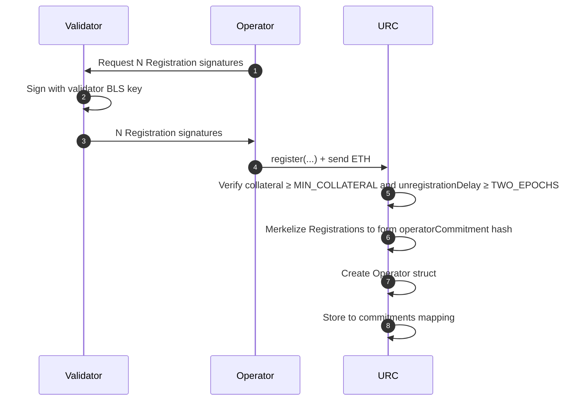
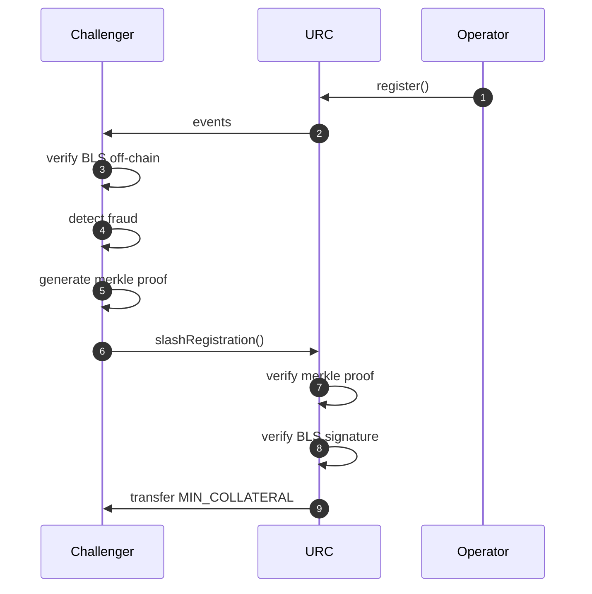

# URC Overview

## Milestones
- [X] Batch register an operator (cheaply)
- [X] Unregister/Claim collateral
- [X] Slash with bytecode
- [ ] Slash with arbitrary `Slasher` contracts
- [ ] Social consensus on design
- [ ] ERC
- [ ] Audit

## Schemas
The message signed by a validator's BLS key and supplied to the URC during registration.
```
struct RegistrationMessage {
    /// Compressed ECDSA key without prefix (optional TBD)
    bytes32 proxyKey; 

    /// The address used to deregister validators and claim collateral
    address withdrawalAddress; 

    /// The number of blocks that must elapse between deregistering and claiming
    uint16 unregistrationDelay; 
}
```

The off-chain commitment message signed by a validator's BLS key (or proxyKey TBD). Should follow the API specs.
```
struct DelegationMessage {
    /// Validator's compressed BLS public key
    bytes validatorPubkey; 

    /// Delegate's compressed BLS public key
    bytes delegatePubkey; 

    /// Compressed ECDSA key without prefix (optional TBD)
    bytes32 proxyKey; 

    /// Hash of the slashing bytecode to be executed
    bytes32 bytecodeHash;

    /// Arbitrary metadata to be included in the delegation (we should include the OperatorCommitment)
    bytes metadata; 
}
```

## Optimistic Registration Process
The Optimistic Registration system allows validators to register for proposer commitment services with minimal upfront verification, while maintaining security through a fraud-proof window. We define an `operator` to be an entity who registers one or more validators.

### Off-Chain Preparation
For each validator to register, the operator signs a `RegistrationMessage` with their validator's BLS key. This action binds the validator key to a `proxyKey` (ECDSA) used to sign off-chain proposer commitments. They also select a `withdrawalAddress` that can unregister and claim collateral. The `withdrawalAddress` wallet does not interact with the proposer commitment supply chain and can be in cold storage or a multisig.

### register()
```solidity
function register(
    Registration[] calldata registrations,
    bytes32 proxyKey,
    address withdrawalAddress,
    uint16 unregistrationDelay
) external payable;
```

```solidity
/// Mapping from registration merkle roots to Operator structs
mapping(bytes32 operatorCommitment => Operator) public commitments;
```

The operator supplies at least `MIN_COLLATERAL` Ether to the contract and batch registers `N` validators. To save gas, the contract will not verify the signatures of the `Registration` messages, nor will it save the validator public keys directly. Instead, the register function will merkleize the inputs to a root hash called the `operatorCommitment` and save this to the `commitments` mapping. An `Operator` is constructed to save the minimal data for the operator's lifecycle, optimized to reduce storage costs.

```solidity
    struct Operator {
        /// Compressed ECDSA key without prefix
        bytes32 proxyKey; 

        /// The address used to deregister validators and claim collateral
        address withdrawalAddress;

        /// ETH collateral in GWEI
        uint56 collateral;

        /// The block number when registration occured
        uint32 registeredAt;

        /// The block number when deregistration occured
        uint32 unregisteredAt;

        /// The number of blocks that must elapse between deregistering and claiming
        uint16 unregistrationDelay;
    }
```



### slashRegistration()
After registration, a fraud proof window opens during which anyone can challenge invalid registrations. Fraud occurs if a validator BLS signature did not sign over the supplied `RegistrationMessages`. To prove fraud, the challenger first provides a merkle proof to show the `signature` is part of the `OperatorCommitment` merkle tree. Then the `signature` is verified using the on-chain BLS precompiles. 

If the fraud window expires without a successful challenge, the operator would be eligible to be considered by proposer commitment protocols.

```solidity
function slashRegistration(
    bytes32 operatorCommitment,
    BLS12381.G1Point calldata pubkey,
    BLS12381.G2Point calldata signature,
    bytes32[] calldata proof,
    bytes32 leaf,
    uint256 leafIndex
) external view;
```



## Deregistration Process
todo

## Slashing Process
todo